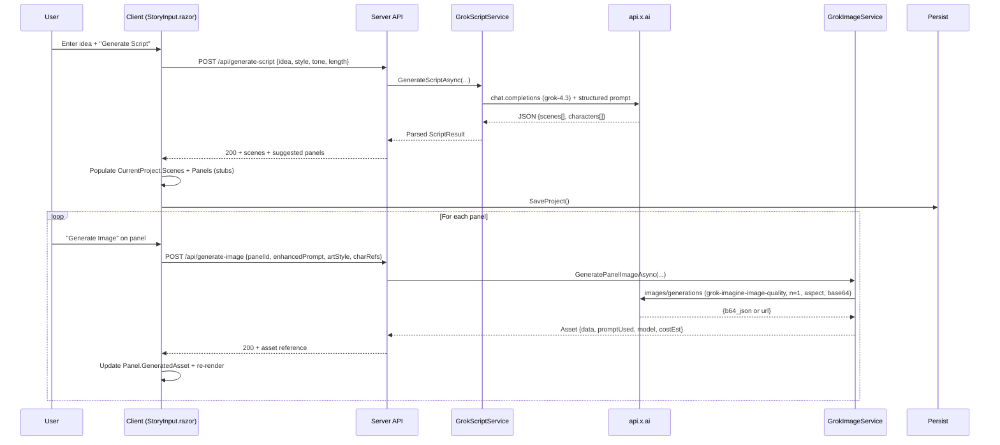
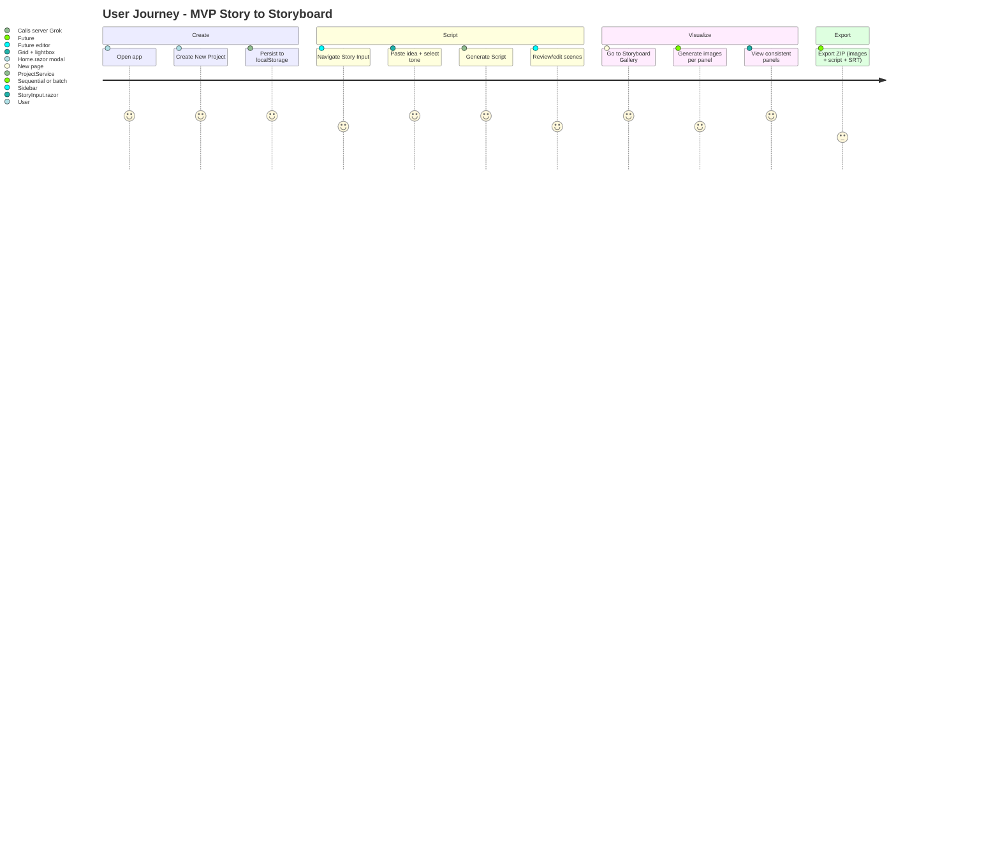

# Design Document: AnimeStoryVideoCreatorApp Full Implementation

**Author**: Grok Systems Architect (placeholder)  
**Date**: 2026-05-27  
**Status**: Draft  
**Project**: AnimeStoryVideoCreatorApp (workspace: `C:\Users\Timot\source\repos\YouTubeVideoCreator\AnimeStoryVideoCreatorApp`)  
**Parent Repo**: YouTubeVideoCreator  

---

## Overview

AnimeStoryVideoCreatorApp is a .NET 10 Blazor hybrid application (Interactive Server + WebAssembly) intended as a "YouTube Video Factory" for producing original anime / manhwa-style story videos. A user supplies a high-level story idea; the system uses xAI Grok models to produce a polished script with scene breakdowns, generates consistent anime-style storyboard panels via the Grok Imagine API (`grok-imagine-image-quality`), allows refinement, and eventually assembles exportable video assets (with voiceover timing) suitable for direct YouTube upload.

Current state (verified via full codebase audit):
- Nested project layout under `AnimeStoryVideoCreator/AnimeStoryVideoCreator/` (server host) and `AnimeStoryVideoCreator/AnimeStoryVideoCreator.Client/` (WASM).
- Only two functional pages: `AnimeStoryVideoCreator/AnimeStoryVideoCreator.Client/Pages/Home.razor` (working New Project modal using heavy inline styles) and `StoryInput.razor` (project summary display from in-memory service).
- All domain models (`Project.cs`, `Scene.cs`, `Character.cs`, `StoryboardPanel.cs`) are stubs except basic `Project` properties.
- All AI and business services (`GrokImagineService.cs`, `ProjectService.cs`, `CharacterService.cs` + interfaces in both server and client `Services/` trees) are empty.
- Client `ProjectService` is a singleton holding `CurrentProject` in memory only.
- Heavy inline CSS duplication; unused `NavMenu.razor`, empty placeholder folders (`Pages/Projects/`, `Analytics/`, etc.); inconsistent DI (client vs server `IProjectService` definitions + registrations); no persistence, no secrets management, no README.
- Builds cleanly. No AI calls, no image handling, no video features.

This document provides a concrete, implementation-ready design addressing architectural simplification, domain model, secure AI integration, persistence, UI evolution (strictly no Tailwind), phased video pipeline, and an incremental PR plan.

---

## Background & Motivation

The app exists to productize the creative workflow: story idea → Grok script + panels → visual storyboard → video. Current stubs block all progress beyond the New Project modal in `Home.razor`.

**Current pain points (directly observed in code)**:
- **No persistence**: Refresh or navigation loses the project created in `Home.razor:103` (`ProjectService.CreateNewProject`).
- **Inconsistent DI and dead services**: Server `Program.cs:15` registers `IProjectService` (from client namespace) against its own empty `ProjectService` (different namespace). Server `Services/Interfaces/` and `GrokImagineService.cs` are unreachable stubs.
- **Architectural complexity too early**: Full hybrid render modes enabled (`AddInteractiveServerComponents` + `AddInteractiveWebAssemblyComponents` in server `Program.cs:18-19`; `MapRazorComponents` with both modes) while 95%+ of UI/state lives in WASM client. Placeholder pages and `MainLayout.razor` nav point to non-existent routes.
- **Styling & component debt**: 100+ lines of duplicated inline `style=` attributes in `Home.razor` and `StoryInput.razor` (cyan `#00F5FF` on `#0F1117`/`#1E2937` dark theme). `input.css` contains Tailwind directives (explicitly unwanted). No reusable components despite `Components/Modals/NewProjectModal.razor` stub.
- **Zero AI surface**: No `HttpClient` configuration, no API key handling, no prompt templates.
- **Missing non-functionals**: No secrets strategy (appsettings contain nothing), no error boundaries beyond default, no bundle/perf consideration for WASM, no tests, no CI.

Motivation for full build-out is the validated "video factory" vision. Incremental vertical slices will deliver usable value quickly while respecting the existing aesthetic and hybrid constraints.

---

## Goals & Non-Goals

**Goals**:
- Deliver a working MVP enabling: create/load projects, story input → Grok-generated script + scene/panel breakdown, one-click panel image generation via xAI Grok Imagine, persistent local storyboard viewer.
- Secure all xAI API usage server-side only via proxy endpoints.
- Establish clean, evolvable domain model + persistence starting with browser localStorage + JSON.
- Preserve and incrementally improve current dark theme / cyan aesthetic using only inline styles + `app.css` (no Tailwind adoption).
- Provide realistic video production path (MVP: exportable assets + simple slideshow; later: FFmpeg or cloud I2V).
- Concrete, reviewable PR plan with small mergeable vertical slices.

**Non-Goals** (explicit boundaries):
- No adoption or migration to Tailwind CSS or any CSS framework.
- No full YouTube OAuth publish in MVP (deferred).
- No real-time collaboration or multi-user.
- No immediate cloud backend persistence (local-first).
- No heavy client-side ML or on-device inference.
- Do not rewrite the entire app as pure Server or pure WASM in one step (evaluate and justify hybrid).
- No paid video generation services in initial PRs (focus on xAI + local first).

---

## Proposed Design

### Architecture Simplification / Justification

**Current architecture** (observed):
```
Client (WASM)                  Server (Host)
- Pages/Home.razor              - Program.cs (registers client IProjectService)
- StoryInput.razor              - Empty server Services/* (dead)
- Singleton ProjectService      - WASM static assets
- Inline styles                 - No API surface
- Empty models/services
```

**Recommendation: Keep hybrid model with aggressive simplification and secure proxy layer.**

Rationale:
- WASM strengths align with vision: offline viewing of storyboards/scripts after generation, fast local UI, future client-side video assembly experiments.
- Server is required for secrets (xAI key must never reach browser). Hybrid already provides this host.
- InteractiveServer mode provides fallback for complex server-only ops (e.g. large video encoding) without extra infra.
- Complexity cost is manageable if we delete dead code immediately and introduce a thin server API surface only.

**Proposed target architecture**:

```mermaid
flowchart TB
    subgraph Browser["Browser (WASM + Server Render Fallback)"]
        UI[Blazor UI Pages & Components<br/>Home, StoryInput, StoryboardViewer, ProjectsList]
        ClientSvcs[Client Services<br/>IProjectService, IStoryGenerationService]
        Persist[(LocalStorage / JSON<br/>Projects Index + Full Graphs)]
    end

    subgraph ServerHost["AnimeStoryVideoCreator (Server Host)"]
        API["Minimal APIs / Controllers<br/>/api/projects, /api/generate-script, /api/generate-image"]
        GrokSvcs["Grok Services<br/>IGrokScriptService, IGrokImageService<br/>(HttpClient → api.x.ai)"]
        Config["Configuration<br/>User Secrets / env: Xai:ApiKey"]
    end

    UI -->|HttpClient (typed)| API
    API --> GrokSvcs
    GrokSvcs -->|POST /v1/chat/completions<br/>POST /v1/images/generations| XAI["api.x.ai<br/>(grok-4.3, grok-imagine-image-quality)"]
    ClientSvcs --> Persist
    ServerHost -.->|InteractiveServer fallback| UI
```

**Key rules**:
- All Grok/xAI calls originate from server `Grok*Service` implementations only.
- Client never receives or stores the xAI key.
- WASM remains primary render mode for core creative flow; server render used only where necessary.

**Render Mode, Service Lifetime, and Hybrid Implications (addressing hybrid complexity)**:
The current server `Program.cs` (lines 15-19, 41-44) enables both `AddInteractiveServerComponents()` / `AddInteractiveWebAssemblyComponents()` and maps both render modes, with `App.razor` forcing `InteractiveWebAssembly` for the router. Client `Program.cs` registers `IProjectService` as `Singleton`; the server registration was previously the source of DI namespace conflicts (client interface against server stub implementation).

**Recommended lifetimes for new abstractions**:
- Client-side API adapters (`ApiStoryGenerationService`, `ApiImageGenerationService` implementing `IStoryGenerationService` / `IImageGenerationService`): `Scoped` (or `Transient` for pure request/response). These are thin HTTP clients and benefit from per-component scoping.
- Server-side Grok services (`GrokChatService`, `GrokImageService` implementing `IGrokScriptService` / `IGrokImageService`): `Scoped` (tied to the HTTP request lifetime for the proxy endpoints). They own the `HttpClient` to xAI and configuration.
- Persistence (`IProjectService` + `LocalStoragePersistence`): Remains `Singleton` on client (in-memory cache + JS interop) for WASM; on server render fallback it still works via the same JS interop.

In **PR 1**, explicitly delete the erroneous `AddScoped<IProjectService, ProjectService>()` line (and its client-namespace usings) from server `Program.cs`. All creative flows (story input, script gen, image gen, storyboard) are implemented exclusively in WASM-rendered pages/components (`@rendermode InteractiveWebAssembly` or default). InteractiveServer is retained only as a fallback for future heavy server-only work (e.g., video encoding in a later phase) and is never required for the core user journey. No shared service registration across render modes will occur after PR 1 cleanup; new server-only services are registered only in the server host builder. This eliminates the prior DI hell while preserving the hybrid safety net.

### Data Flow (Story Generation + Image)



### User Journey (MVP)



### Persistence Strategy

**Phase 1 (MVP)**: Browser-first using `IJSRuntime` + `localStorage`.
- Key `asvc:projects:index` → `List<ProjectMetadata>` (id, name, series, updatedAt, thumbnail?).
- Key `asvc:project:{guid}` → full serialized `Project` (with embedded base64 images for small assets; larger assets use object URLs or deferred).
- Max practical size: ~5-10 MB per project (50 panels @ ~100-200KB base64 each before optimization). Warn users.
- On load: hydrate `IProjectService` (now multi-project aware) from storage.
- Works identically in WASM and Server render modes via JS interop.

**Evolution**: Add optional server-side SQLite (EF Core + SQLite for hybrid) or IndexedDB wrapper. Introduce `IPersistenceProvider` abstraction. For very large assets, introduce `GeneratedAsset` with external file refs (server temp storage + download).

### Serialization Contract (for localStorage + System.Text.Json)

**GeneratedAsset model** (full definition, placed in `Models/GeneratedAsset.cs`):

```csharp
public record GeneratedAsset
{
    public Guid Id { get; init; } = Guid.NewGuid();
    public string PromptUsed { get; init; } = "";
    public string Model { get; init; } = "grok-imagine-image-quality";
    public string? DataBase64 { get; init; }          // Embedded for MVP (< ~2MB per asset)
    public string? ExternalRef { get; init; }         // Future: object URL, server temp path, or CDN
    public string MimeType { get; init; } = "image/png";
    public DateTime Timestamp { get; init; } = DateTime.UtcNow;
    public double? CostEstimateUsd { get; init; }
    public string? ModerationFlag { get; init; }      // From xAI response
}
```

**JsonSerializerOptions** (centralized in `Services/Persistence/JsonOptions.cs` or static):

```csharp
public static readonly JsonSerializerOptions PersistenceOptions = new()
{
    PropertyNamingPolicy = JsonNamingPolicy.CamelCase,
    WriteIndented = false,                    // Compact for localStorage
    DefaultIgnoreCondition = JsonIgnoreCondition.WhenWritingNull,
    Converters = { new GeneratedAssetConverter() /* handles base64 vs ref */ }
};
```

**Circular reference handling**: Use `[JsonIgnore]` on `StoryboardPanel.GeneratedAsset` back-refs if needed, or custom `ReferenceHandler.Preserve`. Panels reference assets by `Id` (preferred) or embed for small payloads. `Project.Assets` acts as the canonical list for deduping.

**Size monitoring & limits** (in persistence service):

```csharp
public async Task SaveCurrentProjectAsync()
{
    var json = JsonSerializer.Serialize(CurrentProject, JsonOptions.PersistenceOptions);
    if (json.Length > 8_000_000) // ~8 MB practical limit
    {
        // Warn + suggest externalization or panel count reduction
        await JS.InvokeVoidAsync("alert", "Project approaching storage limit. Consider exporting assets.");
    }
    await JS.InvokeVoidAsync("localStorage.setItem", $"asvc:project:{CurrentProject.Id}", json);
    // Update index...
}
```

**ProjectVersion handling**:

```csharp
public class Project
{
    public int SchemaVersion { get; set; } = 1;   // Bump on breaking changes
    // ... other fields
}
```

Migration on load: if `SchemaVersion < current`, run lightweight upgrader (e.g., populate new fields with defaults). Max practical panels before externalization: **~30-40** (with base64 images) before hitting comfortable localStorage/browser limits. Warn at 25 panels.

**Persistence service sketch** (`LocalStoragePersistence.cs`):

```csharp
public async Task<List<ProjectMetadata>> LoadIndexAsync() { ... }
public async Task<Project?> LoadFullProjectAsync(Guid id) { ... }
public async Task SaveFullProjectAsync(Project p) { /* size check + serialize */ }
```

### MVP Video Export Decision (resolves Open Question #2 for PR 9)

**Primary path for MVP (PR 9)**: **(a) Pure client-side canvas + SpeechSynthesis + MediaRecorder**.

Rationale for local-first creative tool:
- Zero additional infrastructure or API keys.
- Works entirely offline after images/scripts are generated.
- Leverages WASM strengths (canvas, Web Audio/SpeechSynthesis API, MediaRecorder) already present in the browser.
- Matches the "slideshow + TTS first" goal in Non-Goals and Alternatives #4.
- Produces a downloadable WebM (or MP4 via simple ffmpeg.wasm opt-in later) with timed panels + narration + captions directly from the storyboard.

**Implementation sketch for PR 9**:
- New client service `IExportService` (or extension on `StoryboardGallery`).
- For each panel in order: draw image (from base64 or blob) + caption to offscreen `<canvas>`, advance timeline.
- Simultaneously drive `window.speechSynthesis.speak()` (with rate/pitch/voice selection per character if available) while recording via `MediaRecorder` on a hidden audio element or combined canvas stream.
- Output: single `.webm` file (or fallback ZIP of PNGs + `.srt` subtitles + separate `.mp3` narration tracks via `AudioContext` export).
- Timing derived from `Scene.DurationSeconds` + `StoryboardPanel.StartTimeSec`.

**Server-side FFmpeg.NET (option b)**: Explicitly deferred to post-MVP Phase 3+ (documented in `docs/VIDEO-PIPELINE.md`). It would require server-side asset upload, process isolation for ffmpeg, higher latency/cost, and breaks pure offline use. Only pursued if user feedback demands higher production quality motion.

This choice closes Open Question #2 authoritatively for the initial shippable milestone.

### Component & Styling Strategy (No Tailwind)

- **Preserve aesthetic exactly**: `#0F1117` bg, `#1A1F2E`/`#1E2937` cards, `#00F5FF` accents, rounded-2xl inputs/buttons.
- Enhance `AnimeStoryVideoCreator/AnimeStoryVideoCreator.Client/wwwroot/css/app.css` with CSS custom properties and reusable classes (`.btn-primary`, `.card`, `.input`, `.modal`, `.panel-grid`).
- Extract from `Home.razor`:
  - `Components/Common/PrimaryButton.razor`
  - `Components/Common/Modal.razor` (base with backdrop + escape handling)
  - `Components/Common/FormField.razor`
  - `Components/Storyboard/PanelCard.razor`
- All new UI uses the same inline + class pattern as existing working code for consistency during transition.
- Accessibility increments: `aria-*` on modals/buttons, visible focus rings (cyan glow), semantic headings, keyboard support for lists.
- No new CSS frameworks or PostCSS/Tailwind build steps.

---

## API / Interface Changes

### New Client Interfaces (place in `AnimeStoryVideoCreator.Client/Services/Interfaces/`)

```csharp
// IProjectService.cs (replace stub)
public interface IProjectService
{
    Project? CurrentProject { get; }
    List<ProjectMetadata> Projects { get; }
    Task LoadProjectsAsync();
    Task CreateNewProjectAsync(Project project);
    Task LoadProjectAsync(Guid id);
    Task SaveCurrentProjectAsync();
    Task DeleteProjectAsync(Guid id);
}

// IStoryGenerationService.cs (new)
public interface IStoryGenerationService
{
    Task<ScriptGenerationResult> GenerateScriptAsync(string storyIdea, string artStyle, string targetLength, string tone);
}

// IImageGenerationService.cs (new)
public interface IImageGenerationService
{
    Task<GeneratedAsset> GeneratePanelImageAsync(string enhancedPrompt, string artStyle, Guid? characterId = null, string? aspectRatio = "16:9");
}
```

### Server Interfaces (new, `AnimeStoryVideoCreator/Services/Interfaces/` — replace stubs)

```csharp
public interface IGrokScriptService
{
    Task<ScriptGenerationResult> GenerateScriptAsync(ScriptRequest request, CancellationToken ct = default);
}

public interface IGrokImageService
{
    Task<GeneratedAsset> GenerateImageAsync(ImageRequest request, CancellationToken ct = default);
}
```

### Server API Surface (new minimal APIs in `Program.cs` or `Api/` folder)

```csharp
// Example endpoints (server Program.cs or extension)
app.MapPost("/api/generate-script", async (ScriptRequest req, IGrokScriptService grok, ...) => { ... });
app.MapPost("/api/generate-image", async (ImageRequest req, IGrokImageService grok, ...) => { ... });
app.MapGet("/api/projects", ...);
```

Client will use `HttpClient` (configured with base address from `NavigationManager` or appsettings) injected as `IHttpClientFactory`.

### Client HTTP Configuration (for WASM-primary proxy calls)

**Client-side registration** (edit `AnimeStoryVideoCreator/AnimeStoryVideoCreator.Client/Program.cs`):

```csharp
// After existing AddSingleton<IProjectService, ProjectService>()
builder.Services.AddScoped(sp =>
{
    var nav = sp.GetRequiredService<NavigationManager>();
    // Same-origin base for WASM (works in both dev/prod; falls back gracefully under server render)
    var baseUri = new Uri(nav.BaseUri);
    return new HttpClient { BaseAddress = baseUri };
});

// Typed clients for the new generation services (preferred over raw HttpClient)
builder.Services.AddScoped<IStoryGenerationService, ApiStoryGenerationService>();
builder.Services.AddScoped<IImageGenerationService, ApiImageGenerationService>();
```

**ApiStoryGenerationService example** (new file under `Services/`):

```csharp
public class ApiStoryGenerationService : IStoryGenerationService
{
    private readonly HttpClient _http;
    public ApiStoryGenerationService(HttpClient http) => _http = http;

    public async Task<ScriptGenerationResult> GenerateScriptAsync(...) =>
        await _http.PostAsJsonAsync("/api/generate-script", new { ... }).EnsureSuccess().Content.ReadFromJsonAsync<ScriptGenerationResult>();
}
```

**Server minimal API skeleton** (add to server `Program.cs` after builder.Build(), before app.Run()):

```csharp
app.MapPost("/api/generate-script", async (ScriptRequest req, IGrokScriptService grok, ILogger<Program> log, CancellationToken ct) =>
{
    try
    {
        var result = await grok.GenerateScriptAsync(req, ct);
        return Results.Ok(result);
    }
    catch (Exception ex)
    {
        log.LogError(ex, "Script generation failed for project {ProjectId}", req.ProjectId);
        return Results.Problem(statusCode: 502, title: "Upstream AI error", detail: "Retry in a moment.");
    }
}).RequireAntiforgeryToken(); // or appropriate policy

// Similar MapPost for /api/generate-image using IGrokImageService
```

**Lifetimes & notes**: Client adapters are `Scoped`. Server Grok services are `Scoped` (see Architecture section). Timeouts: configure `HttpClient` with `Timeout = TimeSpan.FromSeconds(30)` for script, longer for images. No pre-rendering of generation pages. All calls are same-origin, eliminating CORS.

**Before/After DI**:
- Before: Duplicate interfaces + wrong registration in server `Program.cs`.
- After: Single source of truth for client contracts; server-only low-level Grok services registered only on server; client services use HttpClient adapters or direct for local persistence.

### AI Prompt Engineering & Contract Details (for PR 4 & PR 5)

**ScriptGenerationResult** (client + server DTO):

```csharp
public record ScriptGenerationResult
{
    public List<SceneDto> Scenes { get; init; } = new();
    public List<CharacterDto> Characters { get; init; } = new();
    public string? Notes { get; init; }
    public int EstimatedTokens { get; init; }
}

public record SceneDto(int Order, string Title, string Description, string? Dialogue, int DurationSeconds, List<string> ImagePrompts);
public record CharacterDto(string Name, string Description, string? VoiceHint);
```

**Parsing strategy (closes Open Question #1 for PR 4)**: Prefer **tool calling / strict JSON schema** with the Grok chat completions API (supported on `grok-4.3`). Server `GrokChatService` will define a tool:

```json
{
  "type": "function",
  "function": {
    "name": "emit_script",
    "description": "Emit the complete structured script",
    "parameters": { "$schema": "...", "type": "object", "properties": { "scenes": {...}, "characters": {...} } }
  }
}
```

Fall back to "best effort + JSON repair" (simple regex + `JsonSerializer` + one retry with "Output ONLY valid JSON") only if tool call fails. This gives reliable parsing without the developer inventing logic during PR 4.

**System prompt skeleton** (stored in `Resources/Prompts/ScriptGeneration.txt` or embedded):

```
You are an expert anime/manhwa YouTube scriptwriter. 
Given the user's story idea, target length, art style, and tone, produce a complete script.

Rules:
- Break into 8-20 scenes maximum for a {TargetLength} video.
- Each scene must have title, rich visual description, optional dialogue, suggested duration (seconds), and 1-3 detailed image prompts.
- Incorporate the provided art style ("{ArtStyle}") and tone ("{Tone}").
- Return ONLY by calling the emit_script tool with the exact schema. No extra text.
```

**Image prompt enhancement** (in `GrokImageService` or before calling client `IImageGenerationService`):

Base prompt from script + appended: `, {ArtStyle} anime/manhwa style, highly detailed, cinematic lighting, consistent character appearances: {CharacterDescriptions joined}`.

**Error contract** (shared):

```csharp
public record GenerationError(string Code, string Message, bool IsRetryable, string? UserGuidance);
```

All generation methods can throw or return `Result< T, GenerationError >` style for clean UI handling (retry button, cost warning, moderation block).

**Character consistency injection**: Character descriptions from `Project.Characters` are concatenated into every image prompt and the script system prompt. In PR 7 this becomes richer (reference seeds).

---

## Data Model Changes

Full models replace stubs in `AnimeStoryVideoCreator.Client/Models/`. Server may share via source or simple DTOs (prefer client models + server DTOs for API to keep WASM lean).

**Core models** (proposed):

```csharp
// Project.cs
public class Project
{
    public Guid Id { get; set; } = Guid.NewGuid();
    public string ProjectName { get; set; } = "";
    public string SeriesName { get; set; } = "";
    public string TargetLength { get; set; } = "15-30";
    public string ArtStyle { get; set; } = "Classic";
    public string Tone { get; set; } = "Dark";
    public DateTime CreatedAt { get; set; } = DateTime.UtcNow;
    public DateTime UpdatedAt { get; set; } = DateTime.UtcNow;
    public ProjectStatus Status { get; set; } = ProjectStatus.Draft;

    public List<Character> Characters { get; set; } = new();
    public List<Scene> Scenes { get; set; } = new();
    public List<GeneratedAsset> Assets { get; set; } = new(); // cross-ref
}

// Scene.cs
public class Scene
{
    public Guid Id { get; set; } = Guid.NewGuid();
    public int Order { get; set; }
    public string Title { get; set; } = "";
    public string Description { get; set; } = "";
    public string? Dialogue { get; set; }
    public int DurationSeconds { get; set; } = 30;
    public List<StoryboardPanel> Panels { get; set; } = new();
}

// StoryboardPanel.cs
public class StoryboardPanel
{
    public Guid Id { get; set; } = Guid.NewGuid();
    public Guid SceneId { get; set; }
    public int Order { get; set; }
    public string ImagePrompt { get; set; } = "";
    public string Caption { get; set; } = "";
    public GeneratedAsset? GeneratedAsset { get; set; }  // Reference (preferred) or embedded
    public double StartTimeSec { get; set; }
}

// Character.cs
public class Character
{
    public Guid Id { get; set; } = Guid.NewGuid();
    public string Name { get; set; } = "";
    public string Description { get; set; } = "";
    public string? ReferencePrompt { get; set; }   // Seed text for consistency
    public string? VoiceHint { get; set; }
    // Future: ReferenceImageBase64 or asset Id
}

// GeneratedAsset.cs (full, referenced by Project.Assets and Panels)
public record GeneratedAsset
{
    public Guid Id { get; init; } = Guid.NewGuid();
    public string PromptUsed { get; init; } = "";
    public string Model { get; init; } = "grok-imagine-image-quality";
    public string? DataBase64 { get; init; }
    public string? ExternalRef { get; init; }
    public string MimeType { get; init; } = "image/png";
    public DateTime Timestamp { get; init; } = DateTime.UtcNow;
    public double? CostEstimateUsd { get; init; }
    public string? ModerationFlag { get; init; }
}
```

**Asset lifecycle & references**:
- `Project.Assets` holds the master list (dedup by `PromptUsed` hash or Id).
- `StoryboardPanel.GeneratedAsset` stores a reference (by Id) or the full record for small MVP payloads.
- On project delete: all referenced assets are dropped (no separate cleanup needed in localStorage).
- Externalization path (future): when `DataBase64` exceeds threshold, move to `ExternalRef` (e.g., `blob:` URL or server temp download link) while keeping metadata.
```

**Migration strategy**: None initially (greenfield). Serialization via `System.Text.Json` with the options + converters defined in the Serialization Contract subsection. `SchemaVersion` on `Project` (see Serialization Contract) plus lightweight upgraders on load. Version field on Project for future schema evolution.

---

## Alternatives Considered

1. **Pure Blazor Server** (drop WASM):
   - Pros: Simpler DI/auth/secrets, easier debugging, no bundle size, direct EF SQLite.
   - Cons: Loses offline storyboard viewing (key for creators on the go); higher server load for every interaction; contradicts "WASM strengths" noted in requirements.
   - Trade-off: Rejected for MVP. Hybrid + thin proxy keeps best of both.

2. **Full client-side AI via browser (impossible for keys) or external proxy service**:
   - Pros: No server code.
   - Cons: xAI key exposure (security violation), CORS, rate limits harder, loss of server orchestration for batching/cost tracking.
   - Trade-off: Rejected. Server proxy is non-negotiable.

3. **Immediate SQLite + EF in WASM** (via sqlite-wasm or similar):
   - Pros: Stronger querying, larger storage.
   - Cons: Adds ~1-2MB WASM payload + complex VFS setup; overkill vs localStorage for <100 projects.
   - Trade-off: Deferred to post-MVP. localStorage + JSON is 1-day implementation.

4. **Video via immediate cloud I2V (Kling/Luma/Runway)**:
   - Pros: High quality motion.
   - Cons: Very high per-second cost, complex asset upload, latency 30s-5min per clip, another set of API keys.
   - Trade-off: Phase 3+. MVP uses slideshow + TTS first (near-zero marginal cost).

---

## Security & Privacy Considerations

**Threat model**:
- **High severity**: Accidental or malicious exposure of xAI API key → unlimited image/script generation cost and abuse. **Mitigation**: Key lives only in server `appsettings.Development.json` (via `dotnet user-secrets`) or environment variables. All calls proxied. Never serialized to client. Add server-side request logging (sanitized).
- Prompt injection via user story text: Low impact (Grok is robust); still sanitize obvious control sequences and enforce length limits.
- LocalStorage data: User owns device. No PII sent to xAI beyond prompts (recommend users avoid real names in stories initially). Add "Clear All Data" button.
- WASM bundle: Source maps off in prod; no secrets in client code.
- Future YouTube publish: Use server OAuth flow only.

**Auth**: None for v1 (local desktop tool). Add simple app-level PIN or Windows DPAPI later if needed.

**Data handling**: Generated images returned as base64 initially (easy persistence); offer URL download option. Respect xAI moderation flags.

---

## Observability

- **Logging**: Inject `ILogger` everywhere. Structured logs for:
  - `GrokScriptService`: tokens in/out, duration, model, truncated prompt hash.
  - `GrokImageService`: prompt hash, resolution, n, duration, estimated cost, moderation flag.
  - Persistence: project id + size on save/load.
- **Metrics**: Use `System.Diagnostics.Metrics` counters (`ai.generations.total`, `ai.images.generated`, `ai.errors`). Expose via `/metrics` endpoint if OpenTelemetry added later.
- **UI feedback**: Global error boundary + simple toast service (in-memory queue rendered in MainLayout). Per-action spinners + "Generating... (est. 6s)".
  - Concrete interface (add to `Services/`):
    ```csharp
    public interface IToastService
    {
        void Show(string message, ToastLevel level = ToastLevel.Info);
        event Action<ToastMessage>? OnShow;
    }
    public record ToastMessage(string Message, ToastLevel Level);
    ```
  - Usage from a service or component: `_toast.Show("Script generated (42 scenes, ~1200 tokens)", ToastLevel.Success);` — MainLayout subscribes and renders a fixed toast container with auto-dismiss.
- **Alerting**: None in local app. For future hosted: Application Insights or Seq.
- **Debug**: Dev-only "Dev Tools" panel showing last 5 AI responses + raw prompts (toggleable).

---

## Rollout Plan

- **Feature flags**: 
  ```csharp
  public record FeatureFlags(bool EnableScriptGeneration = false, bool EnableImageGeneration = false, bool EnableVideoExport = false);
  ```
  Registered in server `Program.cs` via `builder.Services.Configure<FeatureFlags>(builder.Configuration.GetSection("Features"));` and exposed via a minimal `/api/features` endpoint. Client adapter (`IFeatureService`) caches it. PR 3 adds the skeleton and wires the first two flags; generation buttons are hidden/disabled until enabled. "Clear All Data" button (mentioned in Security) is implemented in PR 2 under Settings or a dev footer.
- **Staged**:
  1. Internal/dev only (local build).
  2. Merge PRs sequentially; each vertical slice testable in isolation.
  3. Post-MVP: Optional "beta" toggle for video export experiments.
- **Rollback**: Git revert per PR (small slices). Local data: users can delete `%LocalAppData%` or use new "Clear Projects" UI. No cloud state initially.
- **Verification**: Each PR includes manual test steps + (later) Playwright or bUnit tests.

---

## Open Questions

1. ~~Should Grok script output use strict JSON mode / tool calling for 100% reliable parsing, or best-effort + fallback repair logic?~~ **Resolved in AI Prompt Engineering & Contract Details subsection**: Prefer tool calling with strict JSON schema for PR 4; fallback repair only on failure.
2. ~~Preferred first video MVP: (a) pure client canvas + MediaRecorder + SpeechSynthesis, or (b) server-side FFmpeg.NET assembly of images + generated TTS audio?~~ **Resolved in MVP Video Export Decision subsection**: (a) client-side for PR 9 (lowest infra/offline fit). (b) documented for Phase 3+ only.
3. Max panels per project before we force asset externalization or warn on storage? (See Serialization Contract: warn at ~25, hard practical limit ~30-40 with base64.)
4. Character consistency: support reference image upload + "image edit" API calls in first image phase, or text-description only? (Text-description only for PR 5/7; image-edit + reference images deferred.)
5. Long-term: host this as a downloadable desktop app (via MSIX / Tauri wrapper) or keep as web app users run locally? (Remains open; no impact on MVP PRs.)

---

## References

- Current codebase files (all paths relative to workspace root):
  - `AnimeStoryVideoCreator/AnimeStoryVideoCreator.Client/Pages/Home.razor`
  - `AnimeStoryVideoCreator/AnimeStoryVideoCreator.Client/Pages/StoryInput.razor`
  - `AnimeStoryVideoCreator/AnimeStoryVideoCreator.Client/Services/ProjectService.cs` + `IProjectService.cs`
  - `AnimeStoryVideoCreator/AnimeStoryVideoCreator/Services/GrokImagineService.cs` + server interfaces
  - `AnimeStoryVideoCreator/AnimeStoryVideoCreator.Client/Layout/MainLayout.razor`
  - `AnimeStoryVideoCreator/AnimeStoryVideoCreator.Client/wwwroot/css/app.css`
  - `AnimeStoryVideoCreator/AnimeStoryVideoCreator/AnimeStoryVideoCreator.csproj` + client counterpart + `.slnx`
- xAI API (as of 2026-05):
  - Chat: `https://api.x.ai/v1/chat/completions`, model `grok-4.3`
  - Images: `https://api.x.ai/v1/images/generations`, model `grok-imagine-image-quality`
  - Docs: https://docs.x.ai (OpenAI SDK compatible with custom `base_url`)
  - **Disclaimer**: xAI API details (models, exact parameters, pricing, moderation flags) are based on contemporaneous documentation research performed during design and should be re-validated against official docs.x.ai immediately before implementing PR 3/4/5. The documented shapes (endpoints, tool calling, base64 support, aspect_ratio) are the target.
- Blazor hybrid patterns: Microsoft docs on `AddInteractiveWebAssemblyComponents` + `MapRazorComponents`.
- Local persistence patterns in Blazor WASM: localStorage via `IJSRuntime`.

---

## Key Decisions

| Decision | Rationale |
|----------|-----------|
| **Keep hybrid Blazor (WASM primary + server proxy)** | WASM enables offline storyboard review and future client video assembly. Server is mandatory for xAI secrets. Simplification (delete dead server services, thin API layer) mitigates early complexity noted in review. |
| **All xAI calls via server proxy only** | Prevents key leakage (critical security/cost risk). Matches "server-side only" requirement. Client uses `HttpClient` to local server endpoints. |
| **localStorage + System.Text.Json for MVP persistence** | Fast to implement, zero deps, works in both render modes. Sufficient for expected load (dozens of projects, <10MB each). Defers SQLite/IndexedDB complexity. |
| **Define IGrokScriptService / IGrokImageService on server** | Concrete, injectable, testable boundary around prompt engineering + HTTP calls to `api.x.ai` (detailed in new "AI Prompt Engineering & Contract Details" subsection with `ScriptGenerationResult`, tool schema, system prompt skeleton, and `GenerationError`). High-level client services compose them via server API. |
| **Heavy use of inline styles + incremental app.css utilities; no Tailwind** | Directly respects user constraint and preserves exact current aesthetic (#00F5FF on dark slate). Extraction of 4-5 small components reduces duplication without style system change. |
| **Phased video: slideshow + browser TTS first (client-side MVP resolved)** | Lowest cost/risk path to "exportable video" (MVP Video Export Decision subsection selects pure client canvas + SpeechSynthesis for PR 9). Real I2V or server FFmpeg documented as Phase 3+ only. Matches local-first + offline constraints. |
| **Single source-of-truth models in Client** | Most logic lives in WASM. Server uses lightweight request/response DTOs. Avoids new shared classlib project in early PRs. |
| **Small vertical PR slices** | Each delivers runnable value (e.g. "projects persist and list") and is independently reviewable/mergeable. Avoids big-bang risk on hybrid + AI surface. |

---

## PR Plan

The following is a realistic, incremental strategy. Each PR is a small vertical slice or foundational cleanup that can be reviewed, tested, and merged independently. PRs build cumulatively toward MVP. Estimated total: 9 PRs for core usable app.

**Risk/effort annotations** (added per review feedback): Low = mostly mechanical; Medium = integration + UI; High = prompt engineering + external API contracts + serialization edge cases.

**PR 1: Foundation Cleanup & Unified Models** (Low risk)  
- **Files/components affected**: `AnimeStoryVideoCreator/AnimeStoryVideoCreator.Client/Models/` (full Project/Scene/Character/StoryboardPanel/GeneratedAsset + enums), delete server duplicate stubs in `AnimeStoryVideoCreator/Services/Interfaces/` and `Services/*.cs` (ProjectService, CharacterService, GrokImagineService), update server `Program.cs` (remove bad using/registration), client `GlobalUsings.cs`, `_Imports.razor`, `ProjectService.cs` + interface (keep minimal for now).  
- **Dependencies**: None.  
- **Description**: Remove dead code and duplication. Introduce complete domain models with relationships and JSON serialization attributes. Unify DI registration to use client contracts only. App still builds and runs existing Home modal. Add basic unit test project skeleton (xUnit).

**PR 2: Persistence Layer (localStorage + Multi-Project IProjectService)**  
- **Files/components affected**: `AnimeStoryVideoCreator.Client/Services/ProjectService.cs` + `IProjectService.cs` (expand with Load/Save/Delete/List), new `Services/Persistence/LocalStoragePersistence.cs` (IJSRuntime wrapper), `Pages/Projects/ProjectsList.razor` (new, using existing sidebar link), update `Home.razor` and `StoryInput.razor` to use new methods + persist on create, update `MainLayout.razor` nav if needed.  
- **Dependencies**: PR 1.  
- **Description**: Projects survive refresh and multiple creations. "My Projects" page lists and loads them. "New Project" flow saves automatically. Delete support. Manual testing script in PR description.

**PR 3: Server Grok Configuration & Base Proxy Infrastructure**  
- **Files/components affected**: Server `appsettings*.json` + `Program.cs` (add `IHttpClientFactory`, user-secrets instructions in new `docs/SECRETS.md` — not full doc), new `Services/Interfaces/IGrokScriptService.cs` + `IGrokImageService.cs` (stubs), new `Services/GrokChatService.cs` + `GrokImageService.cs` (HttpClient skeleton + config binding for `Xai:ApiKey`), minimal health endpoint.  
- **Dependencies**: PR 1 (for model DTOs if shared).  
- **Description**: Secure config story documented. Server can reach xAI (smoke test via dev endpoint that returns masked key presence). No client exposure. Feature flag skeleton added.

**PR 4: Script Generation Vertical Slice** (High risk — prompt engineering)  
- **Files/components affected**: Server `GrokChatService.cs` (full impl + prompt templates in `Resources/Prompts/ScriptGeneration.txt`), client `Services/IStoryGenerationService.cs` + impl (`ApiStoryGenerationService` using `HttpClient`), update `StoryInput.razor` (wire "Generate Script Now" button + loading + result display replacing stub textarea), new DTOs `ScriptGenerationResult`, update `Project` model to accept script output, persistence integration.  
- **Dependencies**: PR 2 + PR 3.  
- **Description**: End-to-end: paste idea in StoryInput → real Grok call (server) → parsed scenes populated in CurrentProject → visible in UI + auto-saved. Error handling + retry. Demo video in PR.

**PR 5: Basic Storyboard Viewer + Panel Image Generation**  
- **Files/components affected**: New page `Pages/StoryboardGallery/StoryboardGallery.razor` (grid of panels), `Components/Storyboard/PanelCard.razor` (extracted), server `GrokImageService.cs` (full xAI image impl using `grok-imagine-image-quality`, aspect handling, base64), client `IImageGenerationService` + API adapter, wire "Generate Image" in gallery + progress, store `GeneratedAsset` (base64) in project model, update persistence.  
- **Dependencies**: PR 4.  
- **Description**: Users can navigate to Storyboard Gallery, see auto-created panels from script, generate individual images via xAI. Images persist with project. Visual MVP achieved.

**PR 6: UI Component Extraction & Theming Improvements (No Tailwind)**  
- **Files/components affected**: New `Components/Common/` folder + `PrimaryButton.razor`, `ThemedModal.razor` (refactor Home modal into it), `FormInput.razor`, `Card.razor`; `wwwroot/css/app.css` (add :root vars, .btn-primary, .input-dark, .modal etc. while keeping all existing inline working); update Home + StoryInput + new gallery to use mix of old + new; accessibility pass (aria, labels).  
- **Dependencies**: PR 1 only (parallelizable after PR 1; gallery usage can be added incrementally).  
- **Description**: Reduces duplication. Aesthetic 100% preserved. Prepares for future pages. No Tailwind or build changes. (Low-risk debt reduction that benefits all subsequent PRs immediately.)

**PR 7: Character Vault & Consistency Basics**  
- **Files/components affected**: `Pages/CharacterVault/CharacterVault.razor` (new), flesh `Character.cs` model, integrate into script/image prompts (append character descriptions), update `IImageGenerationService` to accept character context, simple character editor form in vault, link from sidebar.  
- **Dependencies**: PR 5.  
- **Description**: Users define recurring characters. Future image prompts automatically include consistency seeds. First step toward "character consistency" goal.

**PR 8: Script/Scene Editing & Polish**  
- **Files/components affected**: Expand StoryInput or new `Pages/ScriptLibrary/ScriptEditor.razor`; scene reordering, panel caption editing, tone re-generation button; better error toasts (global component in MainLayout), loading states everywhere.  
- **Dependencies**: PR 4 + PR 5.  
- **Description**: Makes generated content editable and re-runnable. Closes the core creative loop for MVP.

**PR 9: Simple Video Export MVP + Documentation** (Medium risk)  
- **Files/components affected**: New export service (client-side canvas + SpeechSynthesis + MediaRecorder implementation — **primary client-side path (a) per MVP Video Export Decision**; ZIP + .srt fallback), `Pages/StoryboardGallery` export button, `README.md` (full setup + xAI key + run instructions), `docs/VIDEO-PIPELINE.md` (future options: ffmpeg.wasm, server FFmpeg, Kling), update `MainLayout` footer, final cleanup of placeholder folders if empty.  
- **Dependencies**: PR 5 + PR 8.  
- **Description**: Users can export a timed slideshow video (WebM with narration + captions derived from panel timings) or asset package from any project. Fully offline per resolved MVP Video choice. README enables new contributors. Marks end of initial "full application" build-out per this design. (Previous "or" ambiguity eliminated.)

**Post-MVP (not in initial plan)**: Full video pipeline (FFmpeg or cloud), YouTube publish flow, advanced consistency via image-edit API, tests/CI expansion, telemetry, hosted option.

---

*End of design document. All paths are absolute from workspace root unless otherwise noted. This design is ready for implementation via the PR plan above.*
